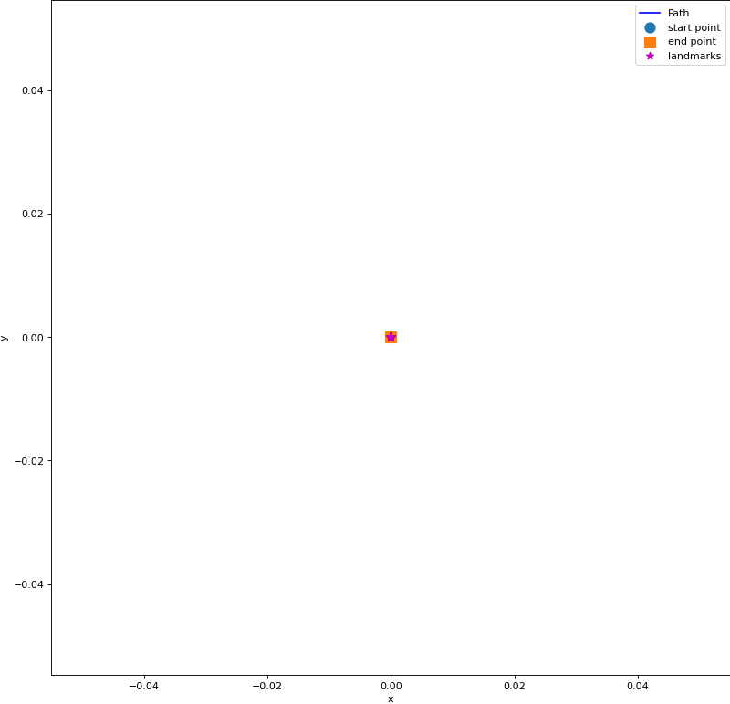

# Visual-Inertial SLAM with Extended Kalman Filter



This repository implements a Visual-Inertial SLAM system using an Extended Kalman Filter (EKF) approach, supporting both IMU-based prediction and visual landmark updates.

## Features
- **Three operational modes**:
  - IMU Localization (Prediction only)
  - Landmark Mapping (Update only)
  - Full Visual-Inertial SLAM
- **Multiple dataset support** with configurable parameters
- **Real-time visualization** of robot trajectory and landmarks
- **GIF generation** for result documentation

## Dependencies
- Python 3.7+
- NumPy
- SciPy
- Matplotlib
- imageio
- tqdm
- transforms3d

## Dataset Structure
Organize datasets in the following structure:
```
data/
├── dataset00/
│ └── dataset00.npy
├── dataset01/
│ └── dataset01.npy
└── dataset02/
  └── dataset02.npy
└── ...
```

## Code Structure
```
code/
├── main.py # Main execution script
├── ekf.py # EKF-SLAM implementation
└── utils.py # Utility functions
```


## Usage

### Configuration
Modify `SLAMConfig` parameters in `main.py` for different datasets:
- `downsample`: Feature sampling rate
- Noise parameters (v_noise, w_noise, etc.)
- Visualization settings
- Running Modes:
  - `prediction`: IMU Localization (Prediction only)
  - `mapping`: Landmark Mapping (Update only)
  - `slam`: Full Visual-Inertial SLAMq

### Running
```bash
cd code
python main.py
```

## Notes
- Adjust `downsample` parameter based on available computational resources
- Tune noise parameters according to sensor specifications
- Runtime varies significantly between datasets

## Results

Please refer to `report.pdf` for the detailed methods description, results and analysis.

## Acknowledgements
- Sensing and Estimation in Robotics (UCSD)